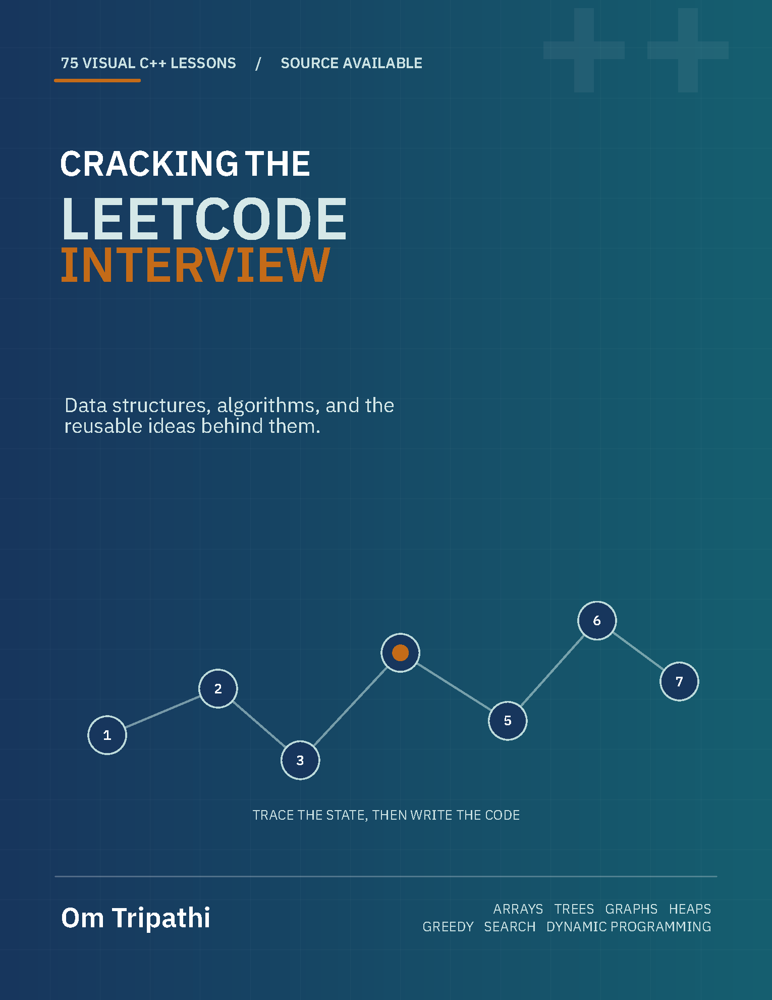

<div align="center">

  <a href="pdf/Cracking-The-LeetCode-Interview.pdf">
    
  </a>

  # Cracking The LeetCode Interview

  ### Blind 75, taught through visual reasoning—not memorized solutions.

  
  
  

  <a href="pdf/Cracking-The-LeetCode-Interview.pdf"><strong>Read the book</strong></a>
  &nbsp;&nbsp;|&nbsp;&nbsp;
  <a href="#the-reading-experience"><strong>Explore the method</strong></a>
  &nbsp;&nbsp;|&nbsp;&nbsp;
  <a href="#support-the-next-volume"><strong>Support the project</strong></a>

</div>

---

> **A serious interview-preparation book for learners who want to understand the move before they make it.**
>
> Every Blind 75 problem is unpacked from first principles: the observation, the data structure, the dry run, the implementation, and the explanation you would give across the interview table.

## The reading experience

This is a structured learning system designed to make recurring interview patterns feel familiar.

| 01. See the idea | 02. Watch it work | 03. Write it confidently |
| :--- | :--- | :--- |
| Start with the problem in plain English, then move from brute force to the key observation. | Follow visual dry runs for pointers, recursion, graph traversals, tries, heaps, and DP states. | Finish with complete C++, complexity analysis, edge cases, and an interview-ready explanation. |

<div align="center">

**Pattern recognition → visual intuition → confident implementation**

</div>

## What is inside

Each of the **75 Blind 75 lessons** is built to be studied, not skimmed:

- **Plain-English problem breakdowns** that clarify what the question is asking.
- **Pattern-first reasoning** that develops the key insight from a simpler approach.
- **Visual dry runs** for pointer movement, recursion, graphs, dynamic programming, tries, heaps, and more.
- **Pseudocode and complete C++ solutions**.
- **Code walkthroughs** focused on the important decisions and state changes.
- **Correctness intuition, time and space complexity, edge cases, common mistakes, and interview follow-ups**.
- A dedicated **STL guide**, visual data-structure reference, and practical interview reference.

| Foundations | Core techniques | Advanced building blocks |
| --- | --- | --- |
| Arrays and hashing | Two pointers and sliding windows | Tries and backtracking |
| Strings and stacks | Binary search and intervals | Graph traversal and topological sorting |
| Linked lists and trees | Heaps and greedy algorithms | Dynamic programming and bit manipulation |

## The patterns you will own

The book moves from foundational questions such as **Two Sum**, **Valid Parentheses**, and **Reverse Linked List** to interview-defining problems including **3Sum**, **Minimum Window Substring**, **Word Search II**, **Alien Dictionary**, and **Binary Tree Maximum Path Sum**.

Problems are grouped by the data structure or algorithmic pattern they teach, creating a sequence in which later lessons reinforce earlier ideas.

## Read the book

<div align="center">

### [Open the complete PDF](pdf/Cracking-The-LeetCode-Interview.pdf)

The complete typeset edition is included in this repository.

</div>

The main LaTeX source lives in [`main.tex`](main.tex), with supporting lessons in [`chapters/`](chapters/). Build the complete book with a LaTeX distribution that includes TikZ and `tcolorbox`:

```bash
latexmk -pdf -jobname=book main.tex
```

Build the standalone cover with:

```bash
latexmk -pdf cover.tex
```

## Study it like an interview candidate

1. **Read the prompt before the solution.** Give yourself a few minutes to form an instinct.
2. **Study the reasoning and visuals.** Focus on the observation that makes the solution work.
3. **Trace the code by hand.** Use the book's dry runs, then try a fresh example.
4. **Re-code without looking.** Explain the approach, complexity, and edge cases aloud, as you would in an interview.
5. **Revisit by pattern.** The payoff comes from recognizing the same idea in a new disguise.

## The next volume starts here

Blind 75 is the foundation. The goal is to extend the same visual, explanation-led format through **NeetCode 150** and beyond, adding lessons that make difficult patterns approachable without diluting the rigor.

If the book helped you, consider starring the repository. It helps more learners discover the project and supports continued work on future lessons.

## Support the next volume

This is an independently built educational project. Contributions support new lessons, improved visuals, corrections, and expansion beyond Blind 75.

<div align="center">

  <a href="upi://pay?pa=omtripathi003%40okaxis">
    
  </a>
  &nbsp;
  <a href="https://www.paypal.me/barryallen2014">
    
  </a>

  **UPI:** `omtripathi003@okaxis` &nbsp;&bull;&nbsp; **PayPal:** [paypal.me/barryallen2014](https://www.paypal.me/barryallen2014)

</div>

Thank you for supporting thoughtful, accessible interview education.

## Connect

Want to collaborate, discuss an opportunity, report a problem, or share feedback on the book? Let us talk.

<div align="center">

  <a href="https://x.com/omtripathi52">
    
  </a>
  &nbsp;
  <a href="mailto:omt4464@gmail.com">
    
  </a>

  [@omtripathi52](https://x.com/omtripathi52) &nbsp;&bull;&nbsp; [omt4464@gmail.com](mailto:omt4464@gmail.com)

</div>

## Contributing

Found a typo, confusing explanation, incorrect result, or visual that could be clearer? Open an issue or submit a pull request. Contributions that improve clarity, visual intuition, accessibility, and correctness are especially welcome.

## Rights, acknowledgements, and disclaimer

This is an independent educational project and is not affiliated with or endorsed by LeetCode. **LeetCode** and associated problem titles are trademarks of their respective owners. They are referenced only to identify the exercises discussed.

Copyright © 2026 Om Tripathi. The source is publicly viewable, but no reuse, redistribution, or resale rights are granted unless a separate license explicitly provides them.

---

<div align="center">
  Made for the moment a hard problem finally makes sense.<br />
  <strong>If that moment happens here, leave a star.</strong>
</div>
